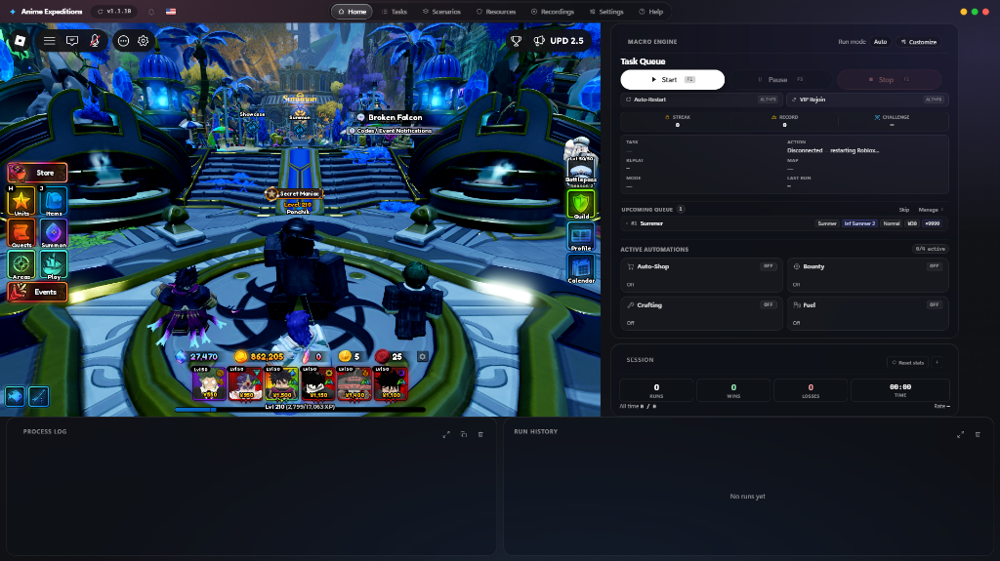
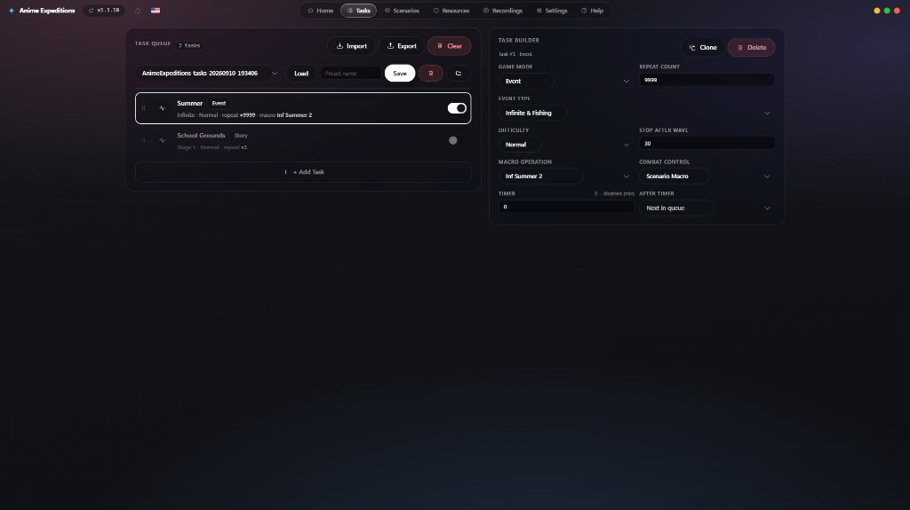
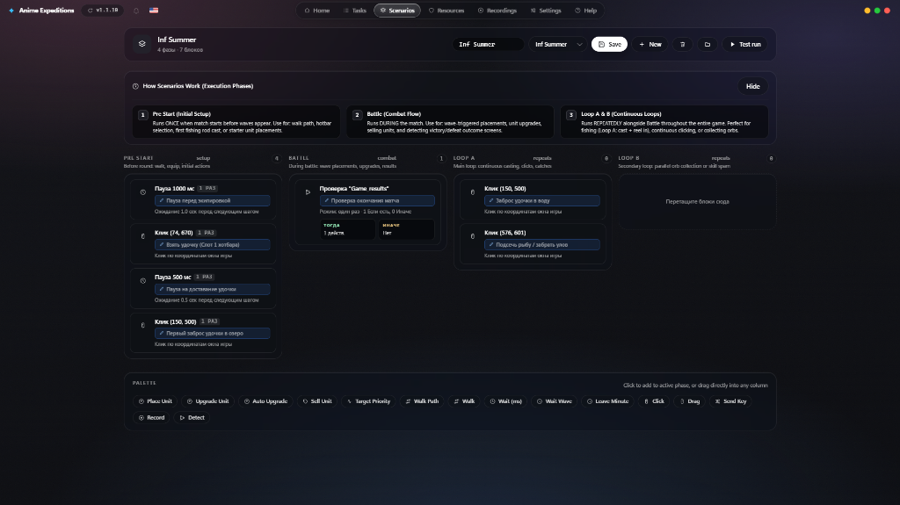

<div align="center">


# Anime Expeditions

**Макрос автофарма для Anime Expeditions в Roblox — Версия 2.0.0**

<p align="center">
  <a href="README.md">English</a> • <b>Русский</b>
</p>

Работает через компьютерное зрение: захват кадра и поиск эталонных изображений.<br>
Без инъекций в память процесса и без чтения структур клиента.<br>
Окно Roblox встраивается непосредственно в интерфейс макроса для автономного прогона.

<br>

<a href="https://github.com/Ponchik0/ae/releases/latest">
  
</a>


<a href="LICENSE">
  
</a>

<br><br>

[Обзор](#обзор) · [Интерфейс](#интерфейс) · [Возможности](#возможности) · [Установка](#установка) · [Первый запуск](#первый-запуск) · [Вебхуки Discord](#вебхуки-discord) · [Документация](#документация) · [Авторство](#авторство)

</div>

---

## Обзор

Форк макроса [Cream's Macro](https://github.com/Cweamy/Anime-Expeditions-Creams-Macro) для игры Anime Expeditions в Roblox с расширенной функциональностью.

**Базовый движок**: Распознавание изображений, алгоритмы навигации по этапам, механизм встраивания окна Roblox (`SetParent`), оптическое распознавание символов (OCR) и базовая логика прогона разработаны автором оригинального проекта [Cweamy](https://github.com/Cweamy). Обновления апстрима регулярно интегрируются в эту сборку.

**Ключевые изменения версии 2.0.0**:
- **Атмосферный Glass UI**: Новый интерфейс с эффектом матового стекла, центрированной плавающей навигацией, строгой контрастной типографикой и полным отсутствием визуального шума и эмодзи.
- **Модульная настройка Дашборда**: Режим кастомизации с перетаскиванием блоков (очередь, серии, службы автоматизации), скрытием ненужных элементов и быстрым управлением.
- **Сохранение разрешения игры в полноэкранном режиме**: При разворачивании окна макроса на весь экран внутреннее разрешение Roblox строго сохраняется на калиброванном значении 1152x756 без искажений и сдвигов координат. Состояние выводится через HUD-уведомления.
- **Службы автоматизации (Active Automations)**: Быстрое переключение и статус фоновых сервисов — авто-скупка в магазине (Auto-Shop), охота за мифическими квестами (Bounty Hunter), авто-крафт и сторож топлива (Fuel Watchdog).
- **Информативные вебхуки Discord**: Чистые эмбеды в стилистике апстрима без спама эмодзи, включающие серии побед, шкалу винрейта сессии, статус автоматизаций и графическую карточку OpenCV.
- **Режим повтора (Replay Mode)**: Запись действий мыши и клавиатуры с абсолютным планировщиком `time.perf_counter()`, сохраняющим точные паузы ожидания внутри боя.

Справочник по историческим координатам AutoHotkey и порогам распознавания находится в файле [`docs/from_ahk.md`](docs/from_ahk.md).

---

## Интерфейс

<p align="center">
  
  <em>Панель управления v2.0.0: встроенное окно Roblox, очередь задач, серии побед, активные службы, журнал и история.</em>
</p>

<p align="center">
  
  <em>Экран «Задачи»: конструктор очередей, универсальный JSON-импорт/экспорт и гибкая настройка повторов.</em>
</p>

<p align="center">
  
  <em>Экран «Сценарии»: визуальный редактор фаз выполнения (Pre Start, Бой, Циклы A & B) с записью ходьбы WASD и палитрой действий.</em>
</p>

---

## Возможности

| Компонент | Техническое описание |
|:--|:--|
| **Встроенное окно Roblox** | Игра закрепляется внутри главного окна макроса через Win32 API `SetParent` (`core/dock.py`). Клики и ввод изолированы и не мешают параллельной работе за компьютером. |
| **Фиксация геометрии** | Разворачивание окна на полный экран адаптирует интерфейс, сохраняя внутренний холст игры в калиброванном разрешении 1152x756. |
| **Очередь задач** | Режимы Story, Expedition, Raid, Tower, Challenge и Portals. Индивидуальный выбор карты, этапа, сложности, количества повторов и режима подбора. |
| **Фарм Порталов** | Открытие порталов прямо из инвентаря, выбор средней карты усилений в бою и непрерывный переход к следующему порталу через экран итогов без выхода в лобби. |
| **Встроенный Auto Play** | Бесшовное переключение на игровой авто-бой с пропуском манипуляций камерой и сохранением состояния между прогонами. |
| **Конструктор Pre Start** | Расстановка юнитов с проверкой успешности клика, смещением при занятой точке, переключением настроек игры и разовыми блоками для первого захода. |
| **Запись действий (Повтор)** | Горячая клавиша F8 запускает и останавливает запись, F9 открывает оверлей. Паузы между кликами воспроизводятся тик в тик по таймеру `time.perf_counter()`. |
| **Фоновые сервисы** | Авто-скупка в магазине по расписанию, ролл мифических квестов на доске баунти, периодический крафт расходников и дозаправка топлива. |
| **Восстановление сессии** | Автоматический возврат в лобби при зависании боя, промахе клика или темном экране. При дисконнекте макрос перезапускает клиент по ссылке `roblox://`. |
| **Уведомления Discord** | Детальные отчеты: результат матча, длительность, номер волны, текущие серии, шкала винрейта и графическая статус-карточка OpenCV. |

<details>
<summary><b>Подробная архитектура автоматизации</b> — развернуть</summary>

<br>

- **Автоматизация Порталов**: Полная поддержка циклов фарма порталов. Макрос сам открывает инвентарь в лобби, активирует нужный портал по имени эталона, в процессе матча автоматически выбирает среднюю карту модификатора и запускает следующий портал сразу из окна наград.
- **Встраивание окна Roblox**: Клиент игры встраивается дочерним окном с фиксированным клиентским размером 1152x756. Все координаты экрана абсолютны и не зависят от системного масштабирования Windows.
- **Охотник за баунти (Bounty Hunter)**: Инспектирует доску квестов события, автоматически делает реролл слотов до выпадения мифической сложности и отправляет задачу на выполнение.
- **Авто-магазин (Auto-Shop)**: Периодически открывает магазин события, выкупая билеты, кристаллы трейтов, рероллы статов и мясо согласно установленным лимитам.
- **Сторож топлива (Fuel Watchdog)**: Отслеживает таймеры выработки станций экспедиций, проходит записанные маршруты между буром и золотой шахтой и пополняет запасы топлива.
- **Сторож зависаний**: Мониторинг пульса задачи по смене действий. Если игра застывает на 25 минут, макрос перезапускает Roblox, восстанавливает состояние очереди и продолжает фарм.

</details>

---

## Вебхуки Discord

Формат сообщений вебхука полностью приведен к аккуратному виду без спама эмодзи и ии-слопа:

- **Исход матча**: Четкий статус Victory, Defeat или Round Finished с фиксацией длительности, карты, этапа, сложности и волны.
- **Сессия**: Время работы, рекорд побед/поражений, процент побед, скорость забегов (Runs/h) и обратный отсчет до сброса Challenge.
- **Все время**: Полная история побед, общий процент и суммарное время работы (Аптайм).
- **Серии**: Текущая непрерывная серия побед или поражений, лучший рекорд в журнале и статистика за текущие сутки.
- **Активные службы**: Статус модулей Shop, Bounty, Crafting и Fuel.
- **Карточка статуса**: К каждому отчету прикрепляется графическая карточка OpenCV и скриншот экрана завершения.

---

## Требования к системе

| Компонент | Требование |
|:--|:--|
| **Операционная система** | Windows 10 или Windows 11 (64-bit) |
| **Клиент Roblox** | Официальная десктопная версия приложения с игрой Anime Expeditions |
| **Python** | Версия 3.10 или новее (при запуске из исходников) |
| **WebView2 Runtime** | Встроен в современные версии Windows (компонент Microsoft Edge) |
| **OCR движки** | RapidOCR / Tesseract OCR (опционально, для считывания названий наград) |

---

## Установка

### Из исходного кода

```bash
git clone https://github.com/Ponchik0/ae.git
cd ae
pip install -r requirements.txt
```

Запуск приложения:

```bash
python main.py
```

Диагностический запуск без открытия графического окна:

```bash
python main.py --test
```

### Готовая сборка

Скачайте файл `Anime Expeditions Macro Setup.exe` со страницы [GitHub Releases](https://github.com/Ponchik0/ae/releases/latest) и запустите установщик. При обновлении пользовательские настройки и добавленные картинки сохраняются.

---

## Первый запуск

1. Запустите Roblox и зайдите в Anime Expeditions — окно игры автоматически встроится в интерфейс макроса.
2. **Задачи**: Сформируйте очередь этапов: режим (Story, Portals, Raid, Expedition), карта, сложность и количество повторов.
3. **Сценарии**: Настройте стартовую расстановку юнитов, начальные хоткеи и траектории движения в Pre Start.
4. **Панель**: Прикрепите сценарии к задачам, настройте расположение модулей через Настройку макета и нажмите **Старт**.
5. **Настройки**: Укажите горячие клавиши, вебхук Discord, ссылку на приватный сервер и визуальную тему.

---

## Тестирование и верификация

Тесты выполняются автономно без запуска игры и без вызовов Windows API:

```bash
pip install -r requirements-dev.txt
python -m pytest tests/ -q
node --check ui/app.js
node --check ui/concept-glass/app.js
node --check ui/i18n.js
```

---

## Документация

| Раздел | Назначение |
|:--|:--|
| [`docs/USER_GUIDE.md`](docs/USER_GUIDE.md) | Подробное руководство пользователя |
| [`docs/architecture.md`](docs/architecture.md) | Архитектура модулей и потоки данных |
| [`docs/from_ahk.md`](docs/from_ahk.md) | Координаты, пороги и технические детали AHK-версии |
| [`AGENTS.md`](AGENTS.md) | Правила разработки, тестирования и выпуска релизов |

---

## Contributors

[Cweamy](https://github.com/Cweamy) — автор оригинального движка ([Cream's Macro | Anime Expeditions](https://github.com/Cweamy/Anime-Expeditions-Creams-Macro), [YouTube](https://www.youtube.com/@Cweamya)). Архитектура компьютерного зрения, навигация по картам, встраивание окна, OCR, расчет координат и базовый цикл прогона написаны Cweamy под лицензией MIT.

---

## Отказ от ответственности

> Данная программа является фанатским инструментом автоматизации. Она не связана с Roblox Corporation или разработчиками Anime Expeditions, не одобрялась ими и не поддерживается. Использование средств автоматизации регулируется пользовательскими соглашениями соответствующих платформ. Все товарные знаки и графические ресурсы принадлежат их законным владельцам.

<div align="center">
<br>

Лицензия [MIT](LICENSE) · Форк проекта [Cweamy/Anime-Expeditions-Creams-Macro](https://github.com/Cweamy/Anime-Expeditions-Creams-Macro)

</div>
